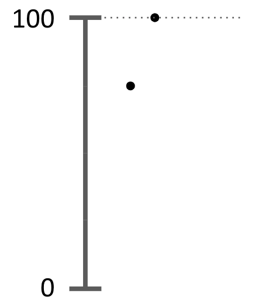

```{r setup, include=FALSE}
knitr::opts_chunk$set(echo = TRUE)
```

### Descripción
En estos ejercicios tienen que integrar `dplyr` y `ggplot2`. Además, van a aparecer otros
paquetes de `tidyverse` que los verán anunciados oportunamente o el paquete para trabajar
con fechas `lubridate`. 

```{r message=FALSE}
require(tidyverse)
```

### Ejercicios

##### 1 Datos del experimento de visualización

En la [clase de visualización](https://youtu.be/Pc3vxs2ZPAE?t=870) participaron de un 
[experimento](https://forms.gle/B5FpDJGTp1i8d4E87). Una de las preguntas era cuál es
el área del círculo pequeño respecto del más grande en esta figura:

{width=20% height=20%}

La respuesta correcta era 75%. La otra pregunta relevante era a qué altura está el punto de 
abajo, entre 0 y 100, en la siguiente figura:

{width=20% height=20%}


Las respuestas de ustedes están en [esta planilla](https://docs.google.com/spreadsheets/d/1LrA-7-dJnJaKrLKTPm2eykVdebvPeLiBRKvIYALQY60/edit?usp=sharing).
Lo primero que tienen que hacer es bajar los datos en un csv y luego leerlos en R
con la función `read_csv()` de `tidyverse`. 

Los datos no están en formato tidy, así que no están preparados para usarse ¿Por qué?
Antes de hacer nada, piensen cómo tendrían que verse los datos para que estén en
formato tidy.

Usar la función `pivot_longer()` para transformar los datos a un formato tidy. Llamar
al nuevo dataset `data.tidy`. 


```{r eval=F, echo=T, message=FALSE, warning=FALSE}
d <- read_csv("loquesea.csv")
# tienen nombres las variables? si no tienen, pongan un nombre a cada una, tipo 
# circulos y puntos.
d.tidy <- d %>% pivot_longer(cols = _____, names_to = _____, values_to = _____)
```

Ahora observar con atención el gráfico de abajo y tratar
de reproducirlo. Les puede servir algo de lo que está [acá](https://www.cedricscherer.com/2019/08/05/a-ggplot2-tutorial-for-beautiful-plotting-in-r/#axes)


```{r echo=FALSE, fig.height=3.5, fig.width=5, message=FALSE, warning=FALSE}
d <- read_csv("/Users/gsolovey/Downloads/data_exp.csv")
colnames(d) <- c("circulos","puntos")

d.tidy <- d %>% pivot_longer(cols = c(circulos, puntos), names_to = "preg", values_to = "porc")


ggplot(data = d.tidy, aes(x = preg, 
                            y = porc,
                            color = preg)) +
  geom_violin(fill = "gray80", size = 1, alpha = .5) +
  geom_dotplot(binaxis='y', stackdir='center', dotsize = 1.2, binwidth = 1) + 
  geom_boxplot(outlier.alpha = 0, alpha = 0.4, coef = 0, width = .05) +
  geom_hline(yintercept=75, color = "gray10") +
  coord_flip() +
  theme_minimal() +
  labs(x = "", 
       y = "respuesta (%)",
       color = "",
       title = "Rta. correcta = 75%") +
  theme(axis.title.x = element_text(vjust = 0, size = 15),
        axis.title.y = element_text(vjust = 0, size = 15),
        axis.text.x = element_text(vjust = 0, size = 15),
        axis.text.y = element_text(vjust = 0, size = 15),
        legend.position = "none") 
```


##### 2 Reproducir el siguiente gráfico de gapminder

En este ejercicio trabajamos con el dataset que viene en el paquete `gapminder`. Toda la 
información sobre este paquete está [acá](https://github.com/jennybc/gapminder). Básicamente
tiene la población, la esperanza de vida y el PBI per cápita para distintos países y durante
varios años. 

Instalen el paquete y exploren las variables y la documentación para entender un poco más.

```{r message=FALSE, warning=FALSE, eval=FALSE}
install.packages("gapminder")
library(gapminder)
```

Luego observen este gráfico e intentes replicarlo. Presten atención a qué variables están
mapeadas y cómo están mapeadas.

```{r  echo=FALSE, fig.height=3.5, fig.width=5, message=FALSE, warning=FALSE}

require(tidyverse)
require(gapminder)

gapminder %>%
  group_by(country) %>%
  filter(year == 2007) %>%
  mutate(pop.inmillions = pop / 1000000) %>%
  ggplot(mapping = aes(x = gdpPercap,
                       y = lifeExp,
                       color = continent,
                       size = pop.inmillions)) +
  geom_point() +
  scale_x_continuous(trans = 'log10') +
  labs(x = "PBI per cápita",
       y = "Expectativa de vida (años)",
       color = "Continente",
       size = "Pob. en millones",
       title = "Año 2007 (Fuente: Gapminder)") +
  theme_minimal()
```


##### 3 Temperaturas

En este ejercicio volvemos al dataset de temperaturas y lo usamos para entender
cómo funciona `facet_wrap` y `scale_color_viridis_c`. Nuevamente como referencia
puede ver esta [página](https://www.cedricscherer.com/2019/08/05/a-ggplot2-tutorial-for-beautiful-plotting-in-r)

Instalen el paquete `lubridate` que lo vamos a necesitar:
```{r message=FALSE, warning=FALSE, eval=FALSE}
install.packages("lubridate")
library(lubridate)
```


```{r echo=FALSE, message=FALSE, warning=FALSE, fig.height=10, fig.width=9}
require(lubridate)
d.temp <- read_csv("/Users/gsolovey/Dropbox/work/2021/cursos/laboratorio de datos/TP1/historico_temperaturas.csv")


d <- d.temp %>% 
  mutate( mes.num = case_when( mes == "Enero" ~ 1,
                               mes == "Febrero" ~ 2,
                               mes == "Marzo" ~ 3,
                               mes == "Abril" ~ 4,
                               mes == "Mayo" ~ 5,
                               mes == "Junio" ~ 6,
                               mes == "Julio" ~ 7,
                               mes == "Agosto" ~ 8,
                               mes == "Septiembre" ~ 9,
                               mes == "Octubre" ~ 10,
                               mes == "Noviembre" ~ 11,
                               mes == "Diciembre" ~ 12))  %>% 
  mutate(fecha = make_date(year = año, month = as.double(mes.num))) %>% 
  filter( año < 2020)


ggplot(data = d, mapping = aes(x = fecha, y = media, color = media)) +
  geom_point() +
  geom_line(mapping = aes(y = mínima)) +
  geom_line(mapping = aes(y = máxima)) +
  labs(x = "", y = "Temperatura media (°C)", color = "T (°C)") +
  theme_classic() + 
  theme(axis.text.x = element_text(angle = 45, vjust = 1, hjust = 1, size = 8),
        axis.title.y = element_text(margin = margin(t = 0, r = 20, b = 0, l = 0)),
        plot.margin=unit(c(1,1,1.5,1.2),"cm"),
        strip.text = element_text(face = "bold", color = "black", hjust = 0, size = 8),
        strip.background = element_rect(fill = "gray90", color = "gray")) + 
  facet_wrap(~ año, scales = "free_x") +
  scale_color_viridis_c(option = "plasma")

```


```{r eval=FALSE}
require(lubridate)
d.temp <- read_csv("historico_temperaturas.csv")

# usar mutate() y case_when para crear una nueva variable que contenga 
# el número del mes.
# a esa nueva variable llamarla mes.num
# luego con la función make_date, crear la variable fecha
# por último eliminar los datos del año 2020 porque están incompletos.
d <- d.temp %>% 
  mutate( mes.num = case_when( mes == ___ ~ 1,
                               mes == ___,
                               mes == ___,
                               ___)  %>% 
  mutate(fecha = make_date(year = ___, month = as.double(___))) %>% 
  filter( ___ )


ggplot(data = ___, mapping = aes(x = fecha, y = ___, ___)) +
  geom_point() +
  geom_line(___) +
  geom_line(___) +
  labs(___) +
  theme_classic() + 
  theme(axis.text.x = element_text(angle = 45, vjust = 1, hjust = 1, size = 8),
        axis.title.y = element_text(margin = margin(t = 0, r = 20, b = 0, l = 0)),
        plot.margin=unit(c(1,1,1.5,1.2),"cm"),
        strip.text = element_text(face = "bold", color = "black", hjust = 0, size = 8),
        strip.background = element_rect(fill = "gray90", color = "gray")) + 
  facet_wrap(~ año, scales = "free_x") + # que pasa si no ponen scales = "free_x"?
  scale_color_viridis_c(___) 

```

Modifiquen parámetros dentro de `theme()` para entender qué hace cada uno.

